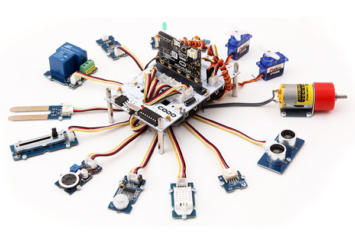
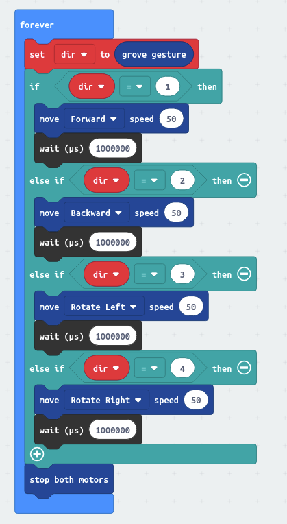
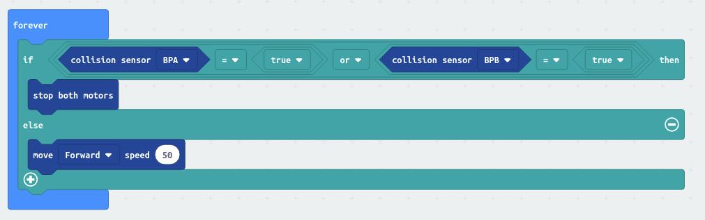
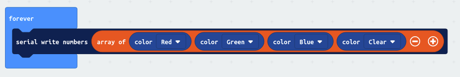

# CODO
Library for Grove micro:bit project board
https://www.a4.fr/carte-de-prototypage-microbit-codo.html

  

## Examples with Blocks :

### Robot Control by hand

Control the robot with your hand



### Robot move until first obstable

Robot go forward until the first wall



### Send color value to serial line

robotcolor

## Examples with JavaScript :

### Robot forward at 75%

```blocks
CODO.robotMove(CODO.RobotDirection.Forward, 75)
```
### Send red color value to serial line

```blocks
serial.writeLine(CODO.measureDistanceCentimeter(DigitalPin.P0))
```
### Rotation at 75% speed

```blocks
CODO.robotMove(CODO.RobotDirection.Forward, 75)
CODO.motorDir(CODO.Motors.Motor1, CODO.MotorDirection.Forward)
CODO.motorDir(CODO.Motors.Motor2, CODO.MotorDirection.Reverse)
```

## API :

### Motion :

- **function robotMove(dir: RobotDirection, speed: number)**

Control Robot speed [0-100%] and direction [forward,backward,turn left, turn right ...].

- **function motorDir(motor: Motors, dir: MotorDirection)**

Change the motor direction.

- **function motorSpeed(motor: Motors, speed: number)**

Change the motor speed.

- **function motorStop()**

Stop both motors.

### Sensors :

- **function measureDistanceCentimeter(name: DigitalPin)**

Return distance from ultrasonic range sensor (centimeter).
    
- **function potarValue(pin: AnalogPin)**

Return analog potentiometer value [0-1023].

- **function color(col: Color)**

Return color from i2c Grove Color Sensor v1.3 or v2.0. It autodetect the sensor version. Output value : [0;65534].

- **function grove_gesture_reads()**

Detect and recognize the gestures from Grove - Gesture
* None:0
* Right:1
* Left:2
* Up:3
* Down:4
* Forward:5
* Backward:6
* Clockwise:7
* Anticlockwise:8
* Wave:9
<br/>(from https://github.com/Seeed-Studio/pxt-grove)

- **function collisionSensor(pin: BP)**

Return collision sensor state [0-1].

- **function detectline(pin: DigitalPin)**

Return line sensor state [0-1].

- **function buttonState(pin: DigitalPin)**

Return button state [0-1].

### Display :

- **function digit_createDisplay(clkPin: DigitalPin, dataPin: DigitalPin)**

Create a new driver Grove - 4-Digit Display.<br/>
(from https://github.com/Seeed-Studio/pxt-grove)

- **function digit_show(dispData: number)**

Show a 4 digits number on 4-Digit Display<br/>
(from https://github.com/Seeed-Studio/pxt-grove)

- **function digit_set(level: number)**

Set the brightness level of 4-Digit Display at from 0 to 7<br/>
(from https://github.com/Seeed-Studio/pxt-grove)

- **function digit_clear()**

Clear the 4-Digit Display<br/>
(from https://github.com/Seeed-Studio/pxt-grove)

- **function ledState(pin: DigitalPin, state: OnOff)**

Set Led state [0-1]

### Actuator :

- **function setServoMotor(pin: AnalogPin, angle: number)**

Set the servomotor position.

## License

MIT

Copyright (c) 2020, A4 Technologie

## Supported targets

* for PXT/microbit
